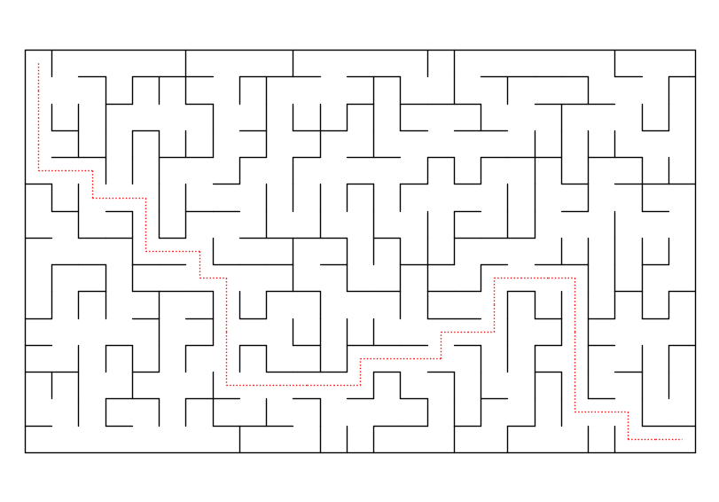

# Mazes

This is a Julia module to create mazes. Begin with `using Mazes`.

A new maze is created with `Maze(r,c)` where `r` and `c` are integers that
are at least two.

To see the maze on the screen, use `draw(M)`. Then to see the solution to the
maze, use `draw_ans(M)`.

### Example
```
julia> using Mazes

julia> M = Maze(10,25)
Maze(15, 25)

julia> draw(M)
```
produces this:


To see the answer, we use `draw_ans(M)` and this is the result:




### Printing

Maze puzzles are easier to solve on paper. To save the maze as a document,
do this:
```
julia> using Plots

julia> savefig("name.pdf")
```
