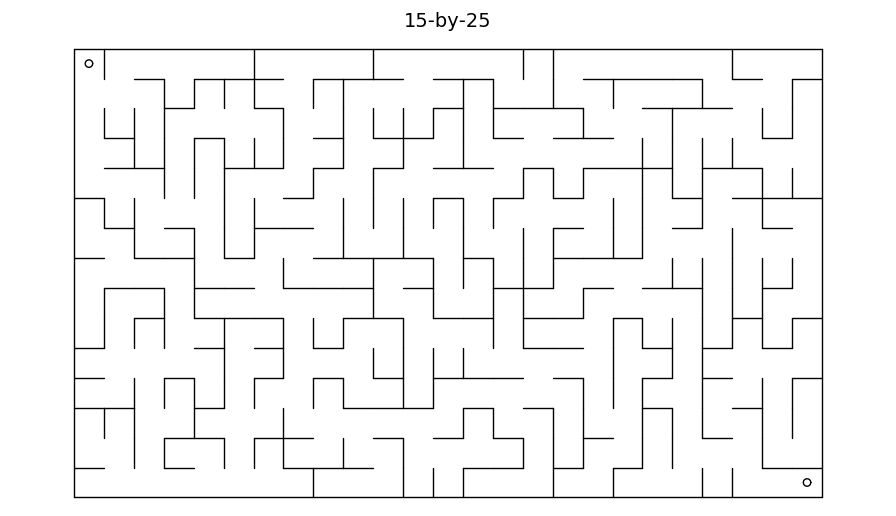
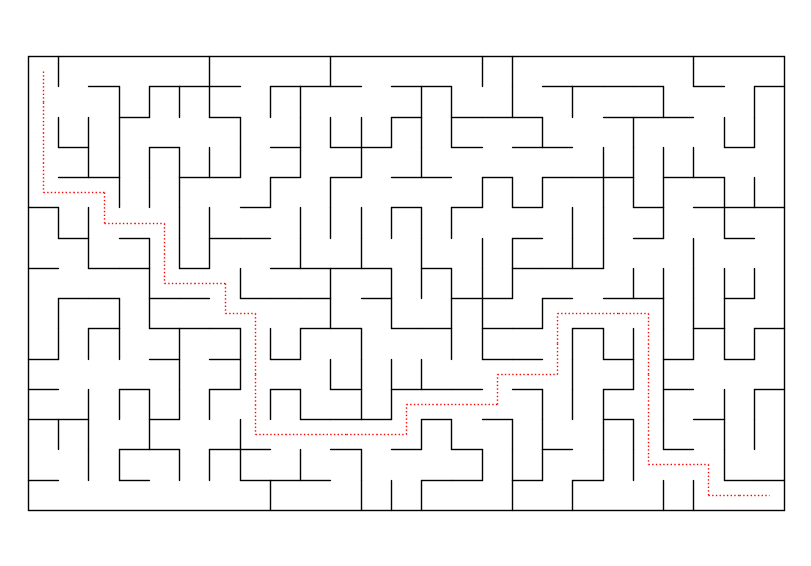

# Mazes


This is a Julia module to create mazes. Begin with `using Mazes`.

A new (random) maze is created with `Maze(r,c)` where `r` and `c` are integers that
are at least two.

To see the maze on the screen, use `draw(M)`. Then, to see the solution to the
maze, use `draw_ans(M)`.

## Example
```
julia> using Mazes

julia> M = Maze(15,25)
Maze(15,25)

julia> draw(M)
```
produces a maze like this:



The full syntax for `draw` is
```
draw(M::Maze, markers::Bool=true, title::Bool=true)
```
where `markers` controls whether small circles are drawn in the upper left
and lower right.

## Solution

To see the answer, use `draw_ans(M)`:




## Printing

Maze puzzles are easier to solve on paper. To save the maze as a document,
do this:
```
julia> using Plots

julia> savefig("name.pdf")
```
